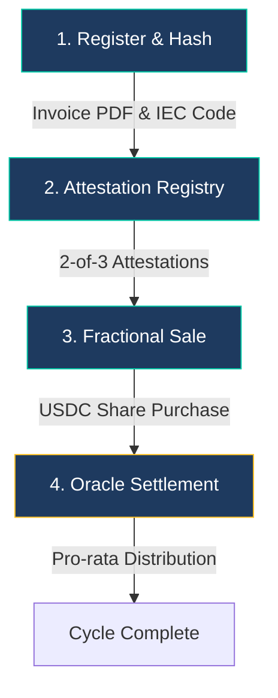
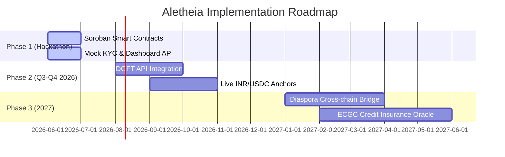

# Aletheia: Pitch Deck
*Democratizing Trade Finance on Stellar*

---

## Slide 1: Title Slide
### *Unlocking Liquidity for Global Trade*

* **Sub-title**: Real-world asset tokenization of export receivables for spice and seafood exporters.
* **Tagline**: Bringing modern decentralized liquidity to Kerala's historic trade routes.
* **Presenter**: [Your Name / Team Name]
* **Event**: Stellar Build Better 2026

#### 🎨 Visual Suggestions
* **Layout**: A premium dark-mode cover slide featuring a stylized background combining a map of historic trade routes with modern glowing blockchain nodes.
* **Icons**: ⚖️ (Aletheia Scales / Balance), 🚢 (Cargo Ship / Commerce), 📈 (Growth).
* **Main Visual**: High-resolution logo of Aletheia with a background gradient shifting from Saffron to Teal (matching the application's design system).

#### 🎙️ Speaker Notes (30 seconds)
> "Welcome, investors and judges. Today, I am proud to present Aletheia—a decentralized trade finance platform built on the Stellar blockchain. Aletheia modernizes a sector as old as globalization itself: trade receivables. We bridge the gap between hard-working agricultural and marine exporters in Kerala, India, and global liquidity providers, solving a multi-billion dollar working capital crisis using Soroban smart contracts."

---

## Slide 2: The Problem
### *The Exporter Working Capital Trap*

* **The Cashflow Gap**: Exporters wait **60 to 90 days** to receive payments from international buyers after shipping cargo.
* **Lack of Bank Access**: Micro, Small, and Medium Enterprises (MSMEs) are locked out of traditional bank factoring due to high collateral requirements and rigid underwriting.
* **Stagnant Growth**: Without cash on hand, exporters cannot buy raw materials for the next cycle, severely limiting their shipment volume.

> [!NOTE]
> **Assumptions Marked (A1)**: Exporters are assumed to pay an average of 12-18% annualized interest if they attempt to obtain informal credit to bridge this cashflow gap.

#### 🎨 Visual Suggestions
* **Layout**: Two columns. On the left, a timeline representing the painful 90-day waiting period. On the right, a red warning box highlighting high informal interest rates.
* **Diagram**: A process flow showing: **Goods Shipped ➡️ 90-Day Cash Flow Void ➡️ Missed Purchase Orders**.
* **Icons**: ⏳ (Hourglass / Waiting), ❌ (Red Cross / Access Denied), 💸 (Money with Wings).

#### 🎙️ Speaker Notes (45 seconds)
> "Exporters of premium spices and seafood in Kerala face a crippling cashflow crunch. After shipping high-value shipments, they must wait up to three months for overseas importers to pay. Traditional banks ignore small-to-medium exporters, demanding excessive collateral. Exporters are forced to seek high-interest informal loans or, worse, sit idle, missing out on new orders. This is a massive working capital trap that limits local economic growth."

---

## Slide 3: The Solution
### *Instant Liquidity via Tokenized Invoices*

* **On-Chain Invoices**: We turn confirmed export receivables into unique, fractionalized Stellar assets.
* **Fractional Purchase**: Global investors purchase trade shares at a discount (e.g., buying $100 of face value for $95).
* **Same-Day Settlement**: Exporters receive working capital immediately; investors earn the yield when the importer pays at maturity.
* **Built on Stellar**: Native compliance, low transaction fees, and sponsored reserves make the onboarding friction-free.

#### 🎨 Visual Suggestions
* **Layout**: Three columns illustrating the value proposition for each stakeholder (Exporter, Investor, and Platform).
* **Diagram**: A clean icon-based flow: **Exporter Uploads Invoice ➡️ Invoice is Tokenized ➡️ Investors Fund ➡️ Exporter Paid Same-Day**.
* **Icons**: 📄 (Invoice / Document), 🪙 (Tokenized Asset), 🤝 (Agreement / Trust).

#### 🎙️ Speaker Notes (45 seconds)
> "Aletheia solves this by tokenizing confirmed trade receivables. Using Soroban smart contracts, an exporter registers an invoice. The system generates a digital representation on Stellar. Global investors can buy fractional shares of this invoice at a discount. The exporter receives working capital immediately, and the investor gains the face-value payout when the invoice matures. By bypassing banking intermediaries, we lower costs and speed up financing from weeks to minutes."

---

## Slide 4: How It Works
### *The 4-Step Receivable Lifecycle*



1. **Register**: Exporter uploads shipping documents. The API hashes the PDF and registers metadata.
2. **Attest**: Verified off-chain entities (Logistics, Export Councils) provide a 2-of-3 multisig attestation.
3. **List**: Once attested, the invoice token is minted and listed on the marketplace at a discount.
4. **Settle**: Importer pays the platform's bank account. A regulated oracle triggers automated smart-contract payouts to investors.

#### 🎨 Visual Suggestions
* **Layout**: A large horizontally-oriented stepper diagram showing the workflow (mirroring the Mermaid chart above).
* **Icons**: 📤 (Upload), ✍️ (Signature / Attestation), 🛒 (Marketplace), 🏛️ (Bank / Oracle).

#### 🎙️ Speaker Notes (60 seconds)
> "Here is how a transaction flows on Aletheia. First, the exporter uploads their shipping bill. The API hashes the document, ensuring tamper-proof storage on-chain. Second, trusted verifiers—like logistics providers and export councils—attest to the cargo's validity. Third, the smart contract mints a unique trade asset and opens it for fractional sale. Investors buy in using USDC. Finally, when the importer pays at maturity, our oracle triggers a pro-rata distribution of funds directly to investor wallets. A complex international finance loop, completed autonomously."

---

## Slide 5: Under the Hood
### *Platform Architecture*

```
┌─────────────────────────────────────────────────────────────┐
│  LAYER 4: Presentation (React, Vite, Freighter Wallet Kit)  │
│  Exporter Dashboard  ·  Investor Dashboard  ·  Supervisor   │
├─────────────────────────────────────────────────────────────┤
│  LAYER 3: Off-Chain Verification (Node.js API, SQLite, IPFS)│
│  SHA-256 Hashing  ·  KYC database  ·  Oracle Settlement    │
├─────────────────────────────────────────────────────────────┤
│  LAYER 2: Soroban Smart Contracts (Rust)                   │
│  ReceivableRegistry  ·  FractionalSale  ·  EscrowContract   │
├─────────────────────────────────────────────────────────────┤
│  LAYER 1: Stellar Ledger (Core Primitives)                  │
│  Native Assets  ·  Clawback  ·  Sponsored Reserves  ·  DEX  │
└─────────────────────────────────────────────────────────────┘
```

* **Frontend**: Optimized for both desktop and mobile Freighter browsers.
* **Database**: Holds secure off-chain metadata linked to on-chain hash logs.
* **On-Chain Contracts**: Manage ownership, escrow funds, and rule validation immutably.

#### 🎨 Visual Suggestions
* **Layout**: A 3D layered architecture diagram (like the ASCII graphic above) showing how the client app interacts with Node.js, and how Node.js communicates with Soroban contracts on the Stellar network.
* **Icons**: ⚛️ (React), 🟢 (Node.js), 🦀 (Rust), 🌟 (Stellar).

#### 🎙️ Speaker Notes (45 seconds)
> "Aletheia is built with a robust, enterprise-grade four-layer architecture. At the top is our React web application, integrated with Freighter wallet for secure key management. Beneath is the off-chain verification layer handling heavy documents, hashing, and metadata. The trust engine sits on Layer 2: our custom Soroban smart contracts written in Rust, which govern registry, sales, and escrow. Finally, this is anchored to the Stellar network, taking advantage of its ultra-fast speed and low transaction fees."

---

## Slide 6: Stellar Advantage
### *Why We Built on Stellar*

* **Native Assets**: Each receivable is represented by a unique native token (e.g., `ML00003`), simplifying transfers.
* **KYC Trustlines**: Using `AUTH_REQUIRED` and `AUTH_REVOCABLE` flags, we restrict token holders to KYC-approved wallets.
* **Sponsored Reserves**: Exporters and investors don't need to hold XLM; our platform sponsors their reserve requirements.
* **Native Clawback**: Ensures compliance and fraud recovery by allowing the platform issuer to claw back tokens if needed.
* **Built-in DEX**: Native support for secondary market listing using Stellar order books without writing complex custom code.

#### 🎨 Visual Suggestions
* **Layout**: A grid of five cards, each representing one Stellar feature, styled with sleek gradient borders.
* **Icons**: 🪙 (Asset), 🛡️ (KYC), 🎁 (Sponsored Reserve), 🧲 (Clawback), 💱 (DEX).

#### 🎙️ Speaker Notes (60 seconds)
> "Stellar is not just a ledger; it is the ultimate global payments and asset issuance toolkit. Rather than writing thousands of lines of custom security code, we utilize Stellar's core primitives. Native asset flags like 'AUTH_REQUIRED' let us enforce regulator-compliant KYC-gated trustlines. Native clawback allows recovery in fraud scenarios. We also utilize Stellar's sponsored reserves, meaning exporters and investors can interact with our platform without ever buying or knowing about XLM—greatly lowering the barrier to entry."

---

## Slide 7: Market Opportunity
### *Kerala's Spice & Seafood Export Engines*

* **Kerala Spices**: The hub of the global cardamom, pepper, and ginger trade.
* **Kerala Seafood**: Contributes over 15% of India's marine product exports.
* **Total Addressable Market (TAM)**: $1.2B in regional annual trade value.
* **Serviceable Obtainable Market (SOM)**: $60M (targeting 5% market capture of MSME exporters within 2 years).

> [!NOTE]
> **Assumptions Marked (A2)**: Regional trade data is estimated based on aggregated export statistics for the Southwest coast of India for the fiscal year 2025.

#### 🎨 Visual Suggestions
* **Layout**: A pie chart or concentric circles showing TAM (Total Addressable Market), SAM (Serviceable Addressable Market), and SOM (Serviceable Obtainable Market).
* **Icons**: 🌶️ (Spices / Agriculture), 🦐 (Shrimp / Marine), 🌍 (Global Market).

#### 🎙️ Speaker Notes (45 seconds)
> "Let's talk market size. Kozhikode was the historic center of the global spice trade, and today Kerala remains a global agricultural powerhouse. Spices and seafood exports from the region account for over $1.2 billion annually. A massive portion of this trade is driven by MSMEs who lack credit facilities. By capturing just 5% of this underserved market over the next two years, Aletheia will unlock $60 million in transactional volume, proving the model before expanding nationally."

---

## Slide 8: Business Model
### *Sustainable and Transparent Revenue*

* **Origination Fee (Exporters)**: **0.5% fee** on the total face value of the receivable upon successful listing and funding.
* **Settlement Fee (Platform)**: **0.25% fee** deducted from the final payout upon successful distribution.
* **Sponsorship Fee**: Flat $1.00 platform fee in USDC per transaction to cover sponsored Stellar account creation reserves.

> [!NOTE]
> **Assumptions Marked (A3)**: The pricing model assumes an average invoice size of $50,000, yielding $375 in total platform revenue per trade.

#### 🎨 Visual Suggestions
* **Layout**: A modern fee breakdown chart, showing how a $50,000 invoice distributes yield to investors and fees to the platform.
* **Icons**: 📥 (Origination), 📤 (Settlement), 🏷️ (Reserve Sponsorship).

#### 🎙️ Speaker Notes (45 seconds)
> "Aletheia's business model is simple and directly aligned with the success of our users. We charge a 0.5% origination fee to exporters when their listing is funded, and a 0.25% settlement fee when the invoice is successfully settled by the importer. We also build in a small flat fee to offset the cost of sponsored Stellar account reserves. Based on an average invoice of fifty thousand dollars, the platform makes three hundred and seventy-five dollars of pure transactional revenue while saving the exporter thousands in bank fees."

---

## Slide 9: Competitive Analysis
### *How We Compare*

| Feature | Aletheia | Traditional Factoring | Generic DeFi Lending |
|---|---|---|---|
| **Collateral Required** | **None** (Invoice-backed) | High Property Collateral | Crypto Over-collateralized |
| **Funding Speed** | **Same-Day (< 1 hr)** | 2 to 4 Weeks | Immediate |
| **Onboarding Cost** | **Sponsored (Zero)** | High Bank Admin Fees | High gas/wallet fees |
| **KYC & Compliance** | **On-chain Gated** | Manual paper audit | None (High regulatory risk) |
| **Investor Asset Class**| **Real Trade Yield** | Locked in Funds | Volatile Crypto Tokens |

#### 🎨 Visual Suggestions
* **Layout**: A premium matrix comparison table (like the markdown table above), highlighting Aletheia's row in green or gold to show superiority.
* **Icons**: ⭐ (Aletheia), 🏛️ (TradFactoring), ⛓️ (Generic DeFi).

#### 🎙️ Speaker Notes (45 seconds)
> "Traditional trade finance is slow and exclusionary, taking weeks of paperwork and demanding heavy property collateral. On the other end, generic DeFi lending platforms require borrowers to post volatile crypto collateral, which physical exporters simply do not have. Aletheia represents a middle path: zero-collateral, real-world asset trade finance that is compliant, fast, and secure. We offer institutional safety with decentralized speed."

---

## Slide 10: Future Scope & Roadmap
### *Beyond the Hackathon*



* **Phase 2**: Direct integration with the **Directorate General of Foreign Trade (DGFT)** API for instant verification of exporter IEC codes.
* **Phase 2**: Partnerships with Indian banks for instant local **INR ↔ USDC** ramps via Stellar Anchors.
* **Phase 3**: Integration with the **Export Credit Guarantee Corporation (ECGC)** to provide automatic credit risk insurance on tokenized invoices.

#### 🎨 Visual Suggestions
* **Layout**: A visual timeline/Gantt chart representing the development phases (matching the Mermaid timeline above).
* **Icons**: 🔗 (API Integration), 🏦 (Bank Ramps), 🛡️ (Credit Insurance).

#### 🎙️ Speaker Notes (45 seconds)
> "Our post-hackathon roadmap is focused on institutional integrations. In Phase 2, we will integrate directly with the Directorate General of Foreign Trade API to verify exporter licenses instantly, and establish INR to USDC bank ramps. In Phase 3, we will integrate credit risk insurance via ECGC, ensuring that even if an importer defaults, the investor's principal is protected. This makes the assets highly secure for conservative institutional capital."

---

## Slide 11: Conclusion
### *Modern Liquidity for Ancient Routes*

* **The Vision**: Bringing trust, speed, and democratization to the $10T global trade finance market.
* **Economic Impact**: Keeping Kerala's spice and seafood industries moving by unlocking millions in trapped capital.
* **Let's Connect**:
  * **Website**: aletheia.io
  * **Email**: contact@aletheia.io
  * **Twitter**: @AletheiaTrade

#### 🎨 Visual Suggestions
* **Layout**: A clean, elegant final slide. Background features a modern container port with a sunset overlay. Contrast of saffron and teal text.
* **Icons**: ⚖️ (Aletheia), 📧 (Email), 🌐 (Web), 🐦 (Socials).

#### 🎙️ Speaker Notes (30 seconds)
> "In conclusion, Aletheia brings modern liquidity to historic global trade. By utilizing Stellar's powerful, compliant, and cost-effective primitives, we keep local industries moving and unlock yield for global investors. Thank you for your time. I am now open to your questions."
